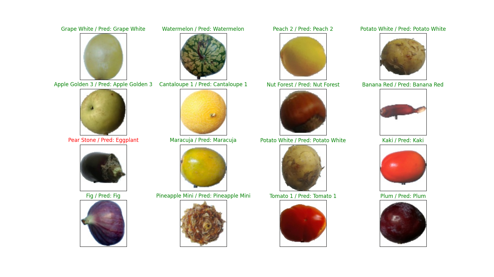

# Fruit Classifier - README.md

## Overview
This project involves two Python scripts for fruit classification using neural networks: `generate-model.py` for model creation and training, and `test-model.py` for model evaluation.

## Prerequisites
- Python
- TensorFlow
- Keras
- scikit-learn
- Matplotlib
- numpy

Install with `pip install tensorflow keras scikit-learn matplotlib numpy`.

## Scripts

### `generate-model.py`
Builds, trains, and saves a CNN model. Includes data loading, preprocessing, and model training functions for fruit image classification.

#### Script Workflow
1. **Data Loading and Preprocessing**
   - `load_dataset`: Loads image data from specified directories.
   - `convert_image_to_array_form`: Converts images into a format suitable for neural network processing.

2. **Model Definition**
   - `tensorflow_based_model`: Constructs a Convolutional Neural Network using TensorFlow and Keras.

3. **Training and Saving**
   - The model is trained using the processed training and validation datasets.
   - After training, the model is saved for future use.

4. **Model Evaluation**
   - The script evaluates the model's performance on a test dataset and prints the accuracy.

#### Key Components
- Uses TensorFlow and Keras for model construction.
- Employs Conv2D, MaxPooling2D, Dropout, Flatten, and Dense layers in the CNN architecture.
- Handles categorical crossentropy loss and uses the RMSprop optimizer.
- Saves the model in the Keras `.keras` format.

### `test-model.py`
is dedicated to evaluating the performance of a pre-trained fruit classification neural network model.

#### Script Workflow
1. **Data Loading and Preprocessing**
   - Similar to `generate-model.py`, this script loads test data and preprocesses it for model evaluation.

2. **Model Loading**
   - The script loads the trained model (`fruit-classifier.keras`) for testing.

3. **Model Evaluation**
   - The model's performance is evaluated on the test dataset. 

4. **Visualization**
   - It generates visualizations of the test images with predicted and actual labels.

#### Key Components
- Uses preprocessed test data for evaluation.
- Includes image visualization with Matplotlib to display test results.
- Predicts fruit categories and compares them with actual labels, highlighting the prediction accuracy.

## Dataset
The scripts are based on fruit-360 dataset that can be acquired here: [Fruits 360](https://www.kaggle.com/datasets/moltean/fruits)

The main directory is split into two subdirectories: 
- fruits-360/Training 
    - contains training data of 131 different fruits
- fruits-360/Test 
    - contains test data of 131 different fruits

## Running the Scripts
1. Run `generate-model.py` to train and save the model.
2. Execute `test-model.py` to test the saved model.

## Training Model

### Training Epoch Results

| Epoch | Training Loss | Training Accuracy | Validation Loss | Validation Accuracy | Time per Epoch | Time per Step |
|-------|---------------|-------------------|-----------------|---------------------|----------------|---------------|
| 1     | 1.8971        | 59.06%            | 0.2555          | 93.51%              | 57s            | 27ms          |
| 2     | 0.2315        | 93.83%            | 0.3103          | 94.20%              | 57s            | 27ms          |
| 3     | 0.1837        | 95.72%            | 0.3592          | 95.71%              | 56s            | 27ms          |
| 4     | 0.1758        | 96.38%            | 0.1880          | 97.30%              | 56s            | 27ms          |
| ...   | ...           | ...               | ...             | ...                 | ...            | ...           |
| 30    | 0.2450        | 98.53%            | 0.8054          | 98.23%              | 57s            | 27ms          |

This table summarizes the results of each training epoch. It includes training and validation loss and accuracy, along with time per epoch and per step. For all 30 epoch details please view epoch.txt file.

### Model description
_________________________________________________________________
#### Layer (type)                Output Shape              Param
=================================================================

 conv2d (Conv2D)             (None, 100, 100, 16)      208

 activation (Activation)     (None, 100, 100, 16)      0

 max_pooling2d (MaxPooling2  (None, 50, 50, 16)        0
 D)

 conv2d_1 (Conv2D)           (None, 50, 50, 32)        2080

 max_pooling2d_1 (MaxPoolin  (None, 25, 25, 32)        0
 g2D)

 conv2d_2 (Conv2D)           (None, 25, 25, 64)        8256

 max_pooling2d_2 (MaxPoolin  (None, 12, 12, 64)        0
 g2D)

 conv2d_3 (Conv2D)           (None, 12, 12, 128)       32896

 max_pooling2d_3 (MaxPoolin  (None, 6, 6, 128)         0
 g2D)

 dropout (Dropout)           (None, 6, 6, 128)         0

 flatten (Flatten)           (None, 4608)              0

 dense (Dense)               (None, 150)               691350

 activation_1 (Activation)   (None, 150)               0

 dropout_1 (Dropout)         (None, 150)               0

 dense_1 (Dense)             (None, 131)               19781

=================================================================

Total params: 754571 (2.88 MB)
Trainable params: 754571 (2.88 MB)
Non-trainable params: 0 (0.00 Byte)
_________________________________________________________________

### Test accuracy: 0.9826619029045105

491/491 [==============================] - 4s 8ms/step - loss: 0.8647 - accuracy: 0.9827

## Test model

To test fruit-classifier.keras we pick randomly 16 images from Test dataset, we plot using matplotlib package 16 different images in the same figure.

If the model prediction was correct, then the label is colored green, otherwise it's colored in red.

E.g.

